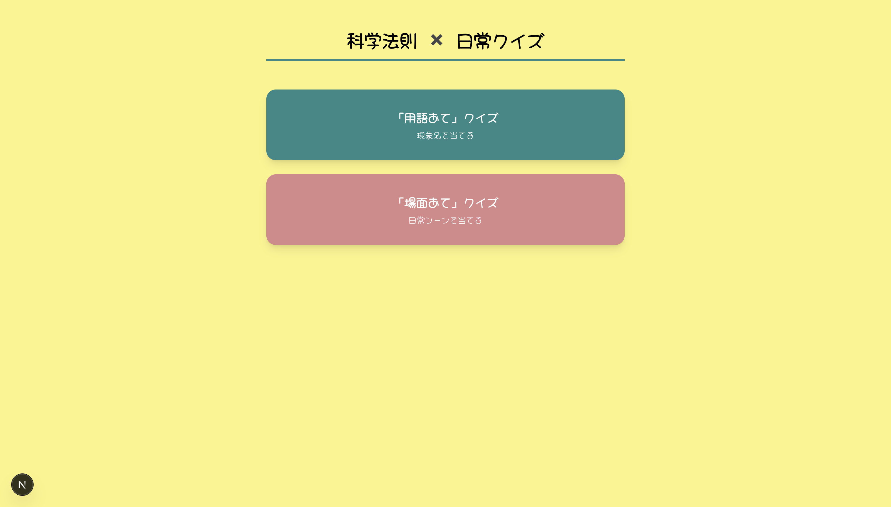

# 科学法則✖️日常クイズアプリ

科学法則を日常の身近な例えで覚えるためのクイズアプリです。

## 画面サンプル

①　トップ画面



②　用語あてクイズ

<video src="" loop muted autoplay playsinline width="100%"></video>

③ 　場面あてクイズ

<video src="" loop muted autoplay playsinline width="100%"></video>

## 🚀 主な機能

- **トップ画面でジャンル選択**:「用語あて」「場面あて」の２種類から選択
- **4 択クイズ**:
  - ランダムに5問出題。
  - 「用語あて」→日常の例から現象名を当てる
  - 「場面あて」→科学法則から日常の例を当てる
  - 終了後に正解数と答え合わせを確認可能。
- **レスポンシブ対応**:画面サイズに合わせて調整済みです。

## 🛠 使用技術

- **Framework**: Next.js (App Router)　v16.2.6
- **CSS**: Tailwind CSS v4
- **Language**: TypeScript
- **Icons/Fonts**: Hachi_Maru_Pop(Google Fonts)

## 🎨 デザインカラー

明るく親しみやすい雰囲気を意識して選びました。

- 背景色: `#fcf486`
- テキスト: `#000000`
- 装飾: `#2d8988`
- 予備: `#d7888a`

## 📦 セットアップ・起動方法

1. リポジトリをクローン

```bash
git clone [リポジトリURL]
```

2. 依存関係のインストール

```bash
npm install
```

3. 開発サーバーの起動

```bash
npm run dev
```

ブラウザで [http://localhost:3000](http://localhost:3000) を開くとアプリが表示されます。

## 参考文献

科学法則の確認に使用しました。

・『科学法則大全』アダム・ダント絵、ブライアン・グレック著、大西光代訳、左巻健男監修、株式会社化学同人、2022年2月
